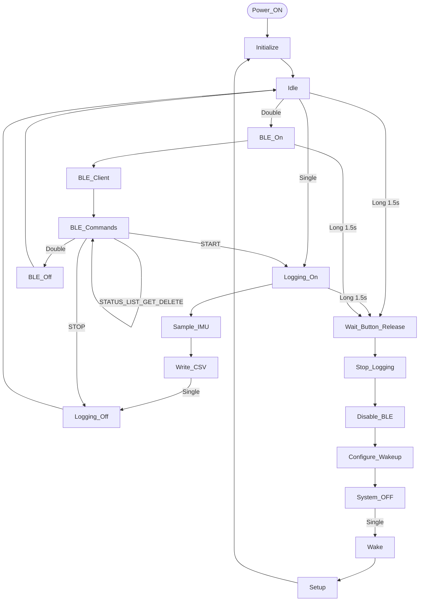
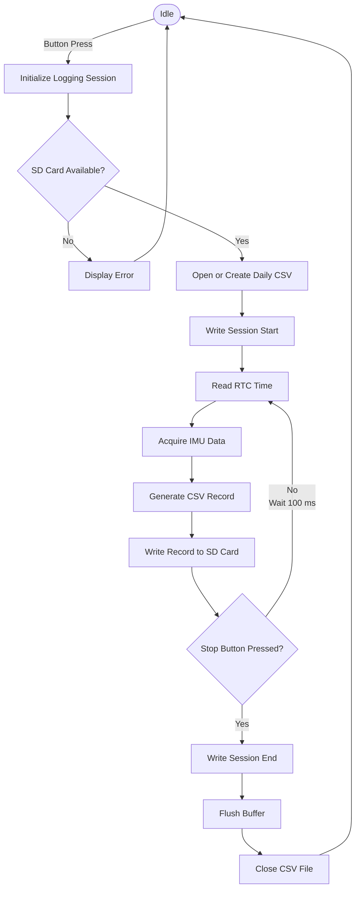
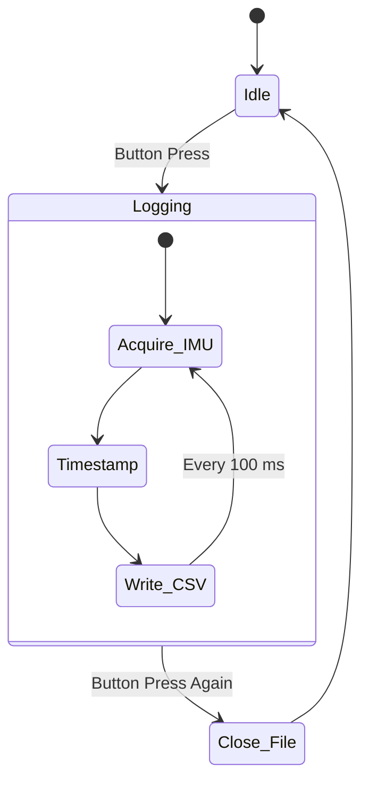
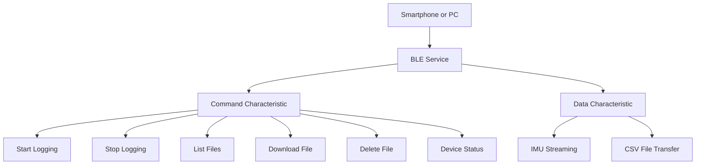

# Motion Data Logger using Seeed XIAO nRF52840 Sense

*A compact Bluetooth-enabled motion data logger capable of recording inertial sensor data with accurate timestamps, storing measurements on a microSD card, and wirelessly managing recordings through a custom Android application.*

---

## Table of Contents

- [[#Overview|Overview]]
- [[#Features|Features]]
- [[#System Specifications|System Specifications]]
- [[#Hardware Components|Hardware Components]]
- [[#System Architecture|System Architecture]]
- [[#Pin Configuration|Pin Configuration]]
  - [[#RTC|RTC]]
  - [[#microSD Card|microSD Card]]
  - [[#Push Button|Push Button]]
- [[#Firmware Overview|Firmware]]
  - [[#System Workflow|System Workflow]]
  - [[#System Initialization|System Initialization]]
  - [[#User Controls|User Controls]]
  - [[#Data Logging|Data Logging]]
  - [[#Sampling Rate|Sampling Rate]]
  - [[#Logging State Machine|Logging State Machine]]
  - [[#Session Management|Session Management]]
- [[#Bluetooth Communication|Bluetooth Communication]]
  - [[#BLE Architecture|BLE Architecture]]
  - [[#Remote Commands|Remote Commands]]
  - [[#Error Recovery|Error Recovery]]
- [[#Python Desktop Client|Python Desktop Client]]
- [[#PCB Design|PCB Design]]
- [[#Project Structure|Project Structure]]
- [[#Acknowledgements|Acknowledgements]]
## Overview

The **Motion Data Logger** is a portable motion acquisition system built around the **Seeed XIAO nRF52840 Sense**. It continuously acquires acceleration and angular velocity from the onboard IMU, timestamps every measurement using a **DS3231 Real-Time Clock (RTC)**, and stores the data in CSV format on a microSD card. Buttons and LEDs are incorported for management of functions.

The device also provides a complete **Bluetooth Low Energy (BLE)** interface that allows wireless control, live sensor streaming, file browsing, downloading, and deletion without physically removing the storage card.

A dedicated Flutter application, **NAPPNU**, together with a desktop Python client, provides an intuitive interface for managing the logger.

---
## Features

- 6-axis IMU motion sensing
- 10 Hz sampling rate
- RTC-based timestamping
- Automatic CSV logging
- Automatic daily log file creation
- Session start/stop markers
- Bluetooth Low Energy (BLE 5.0)
- Wireless file download
- Wireless file deletion
- Remote logging control
- Live IMU streaming
- Flutter Android application
- Python desktop client
- Automatic file append
- Safe file closing after logging

---
## System Specifications

| Parameter          | Value                          |
| ------------------ | ------------------------------ |
| Microcontroller    | Seeed XIAO nRF52840 Sense      |
| MCU                | Nordic nRF52840                |
| IMU                | On-board 6-axis IMU            |
| RTC                | DS3231                         |
| Storage            | SPI microSD Card               |
| Communication      | Bluetooth Low Energy (BLE 5.0) |
| Sampling Rate      | 10 Hz                          |
| File Format        | CSV                            |
| Mobile Application | NAPPNU (Flutter)               |
| Desktop Client     | Python                         |

---
## Hardware Components

| Component                 | Purpose                 |
| ------------------------- | ----------------------- |
| Seeed XIAO nRF52840 Sense | Main controller and IMU |
| DS3231 RTC                | Real-time clock         |
| microSD Module            | Data storage            |
| Push Button               | User input              |
| Smartphone                | BLE communication       |
| Laptop                    | Desktop interface       |

---
## System Architecture
![[BLE Motion Logger.excalidraw]]

The firmware acts as the central controller, coordinating sensor acquisition, timestamp generation, SD card storage, and Bluetooth communication.

---
## Pin Configuration

### RTC

| RTC Pin | XIAO Pin |
| ------- | -------- |
| SCL     | D1       |
| SDA     | D2       |
| RST     | D0       |

---

### microSD Card

| SD Pin | XIAO Pin |
| ------ | -------- |
| CS     | D7       |
| MOSI   | D10      |
| MISO   | D9       |
| SCK    | D8       |

---

### Push Button

| Button Pin | Connection |
| ---------- | ---------- |
| One Side   | D3         |
| Other Side | GND        |

---

### LED interfacing

| LED Pin    | Connection |
| ---------- | ---------- |
| One Side   | D0         |
| Other Side | GND        |

---
## Firmware

The firmware is event-driven and continuously monitors the push button, Bluetooth Low Energy (BLE) interface, and sensor subsystem while maintaining a fixed sampling interval of **100 ms (10 Hz)**. During operation, it performs the following primary tasks:

1. Acquire IMU measurements.
2. Timestamp each sample using the RTC.
3. Store timestamped measurements on the microSD card.
4. Provide wireless BLE communication for device control and file transfer.

---
### System Workflow



---
### User Controls

The logger is controlled using a single push button.

| Action       | Function                                         |
| ------------ | ------------------------------------------------ |
| Single Press | Start/Stop data logging<br>Wakeup from Deepsleep |
| Double Press | Enable BLE communication                         |
| Long Press   | Enable Deepsleep                                 |

---
### Data Logging

When logging starts, the firmware performs the following sequence:



Each record contains:

- Date
- Time
- Millisecond counter
- Acceleration (X, Y, Z)
- Angular Velocity (X, Y, Z)

---
### Sampling Rate

The logger samples the onboard IMU at a fixed interval of:

| Parameter          | Value  |
| ------------------ | ------ |
| Sampling Interval  | 100 ms |
| Sampling Frequency | 10 Hz  |

This provides a balance between storage efficiency, Bluetooth throughput, and motion capture accuracy.

---
### Logging State Machine



---
### Session Management

Each logging session is automatically marked within the CSV file.

Example:

```text
# SESSION START

Date,Time,Millis,Ax,Ay,Az,Gx,Gy,Gz
...

# SESSION STOP
```

If logging is restarted later on the same day, the firmware appends a new session to the existing file instead of creating another file.

---
## Bluetooth Communication

Bluetooth is enabled only when requested by the user, minimizing unnecessary power consumption.

Once activated, the device advertises using the name:

```text
MotionLogger
```

If no client connects within the advertising timeout, Bluetooth is automatically disabled and the system returns to idle mode.

---
### BLE Architecture



The firmware exposes dedicated BLE characteristics for command handling, live sensor streaming, and file transfer, allowing independent operation of each communication channel.

---
### Remote Commands

The firmware supports the following command set.

| Command        | Description                   |
| -------------- | ----------------------------- |
| `STATUS`       | Returns current logger status |
| `START`        | Starts data logging           |
| `STOP`         | Stops data logging            |
| `LIST`         | Lists all CSV files           |
| `G:<filename>` | Downloads a selected file     |
| `D:<filename>` | Deletes a selected file       |

These commands are supported by both the Python desktop client and the NAPPNU Android application.

---
### Error Recovery

The firmware is designed to tolerate common operating conditions.

- Existing log files are opened in append mode.
- Files are closed safely when logging stops.
- Daily log files are created automatically.
- Bluetooth can be re-enabled without restarting the device.
- Logging resumes normally after new sessions begin.

---
## Python Desktop Client

A lightweight Python application is included for desktop communication with the logger.

Supported operations include:

- Connect to the logger
- View logger status
- Start and stop logging
- Browse stored files
- Download CSV files
- Delete CSV files

The desktop client implements the same BLE command protocol as the Android application, providing an alternative interface for file management and real-time monitoring.

---
## PCB Design

To improve the portability and reliability of the Motion Data Logger, a custom PCB was designed using **KiCad**. The PCB replaces the breadboard prototype by providing a compact and organized hardware layout for connecting the development board, RTC module, microSD module, battery, and external peripherals.

### PCB Design Process

The PCB development involved the following steps:

- Circuit schematic creation
- Footprint assignment
- Electrical Rules Check (ERC)
- PCB layout design
- Component placement
- Signal routing
- Design Rules Check (DRC)
- Gerber file generation for PCB fabrication

### Main Footprints Used

| Component | Footprint |
|----------|-----------|
| 1×7 Pin Socket | PinSocket_1x07_P2.54mm_Vertical |
| 1×6 Pin Header | PinHeader_1x06_P2.54mm_Vertical |
| 1×4 Pin Header | PinHeader_1x04_P2.54mm_Vertical |
| 1×2 Pin Header | PinHeader_1x02_P2.54mm_Vertical |
| JST Battery Connector | JST_PH_B2B-PH-K_1x02_P2.00mm_Vertical |

---

### Circuit Schematic

The complete circuit schematic showing the electrical connections between the Seeed XIAO nRF52840 Sense, RTC module, microSD module, battery connector, and other peripherals.

![[nappnu-schematic.png]]

---

### PCB Layout

The routed PCB layout illustrating component placement and signal routing.

![[nappnu-pcb.png]]

---

### 3D Top View

Three-dimensional top view of the designed PCB.

![[nappnu-pcb-3d-topview.png]]

---

### 3D Bottom View

Three-dimensional bottom view of the designed PCB.

![[nappnu-pcb-3d-bottomview.png]]

---
## Project Structure

```text
Motion-Data-Logger/
│
├── Firmware/
│   └── Data_Logger.ino
│
├── Android/
│   ├── lib/
│   ├── assets/
│   ├── android/
│   ├── ios/
│   ├── pubspec.yaml
│   └── README.md
│
├── Desktop/
│   └── connect.py
│
├── Hardware/
│   ├── Motion-datalogger.kicad_sch
│   ├── Motion_datalogger.kicad_pcb
│   └── gerber.zip
│
├── Sample Data/
│   ├── LOG_2026_07_01.CSV
│   ├── LOG_2026_07_02.CSV
│   └── LOG_2026_07_03.CSV
│
├── Documentation/
│   └── Data Logger.md
│
└── README.md
```

---
## Acknowledgements

This project was developed using the following open-source hardware and software platforms:

- **Seeed Studio XIAO nRF52840 Sense**
- **Nordic Semiconductor nRF52840 SoC**
- **Arduino Framework**
- **Flutter**
- **Python**
- **KiCad**