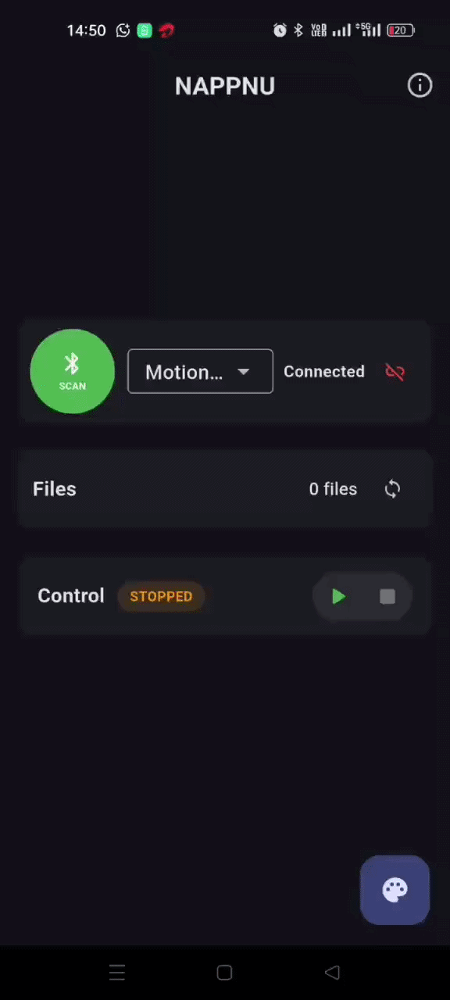
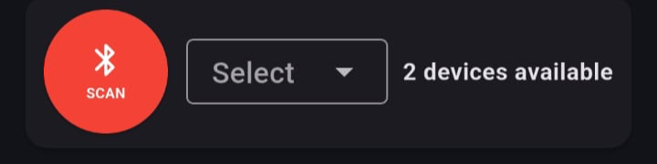
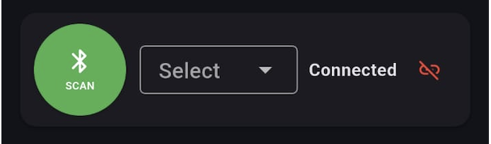
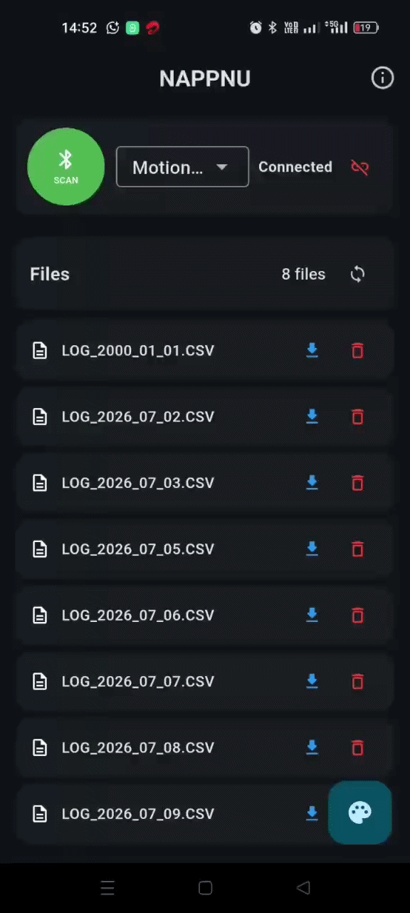
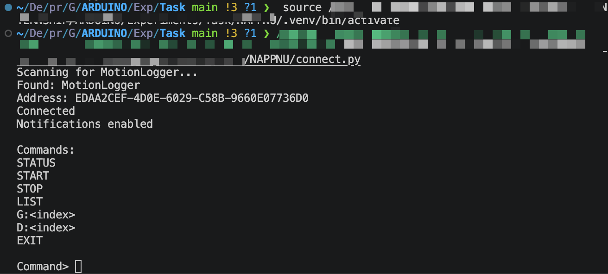

  <p align="center">📟 NAPPNU Motion Data Recorder</p>

<p align="center">
Bluetooth-enabled Motion Data Logger built using the <b>Seeed XIAO nRF52840 Sense</b>.
</p>
---

# 🛠 Hardware Components

<p align="center">

</p>

| Component | Quantity |
|-----------|:--------:|
| Seeed XIAO nRF52840 Sense | 1 |
| DS3231 RTC Module | 1 |
| microSD Card Module | 1 |
| microSD Card (FAT32) | 1 |
| Push Button | 1 |
| Li-Po Battery (3.7 V) | 1 |
| USB Type-C Cable | 1 |

---
<div style="page-break-after: always;"></div>

# 📂 Project Structure

```text
main-folder/
│
├── Mobile Application/
│.  └── motion-logger
│      		└── files.....
│
├── Code-Hardware/
│   └── Data_Logger.ino
│
├── PCB Design/
│   └── KiCAD.zip
│
├── Python-Script/
│   └── connect.py
│
└── README files
```

---

# 💻 Software Requirements


## Firmware Development

- Arduino IDE 2.x
- Seeed nRF52 Board Package

### Required Arduino Libraries

- Adafruit Bluefruit nRF52 Libraries
- LSM6DS3
- SdFat
- RTClib
- Wire
- SPI
- EEPROM

---
<div style="page-break-after: always;"></div>

## 📦 Project Files

All required project files are available in the shared Google Drive folder below.

> 📁 **Download Project Files**  
> https://drive.google.com/drive/folders/1yOiiscPsLclZifj_FWon-T-I5wJ6or7X?usp=drive_link

The folder contains:

- 📱 Pre-built Android APK
- 📱 Flutter source code

---

## 📱 Option 1 — Install the Pre-built APK (Recommended)

1. Open the **Google Drive** folder above.
2. Navigate to:

```
Android-Application/
└── motion_logger/
    └── build/
        └── app/
            └── outputs/
                └── flutter-apk/
                    └── app-release.apk
```

3. Download **app-release.apk** to your Android device.([click here](https://drive.google.com/file/d/1uAppkaTGrx7KVFIq7DyhZL77ZsfjcmHu/view?usp=drive_link))
4. Install the APK.

> **Note:** Enable **Install from Unknown Sources** if prompted.

---

## 👨‍💻 Option 2 — Development Setup

Download the complete project from the Google Drive folder.

### Flutter

```bash
cd motion_logger

flutter pub get

flutter run
```

Generate a release APK:

```bash
flutter build apk --release
```

The generated APK will be available at:

```

build/app/outputs/flutter-apk/app-release.apk

```

---

## Flutter Packages Used

- flutter_blue_plus
- permission_handler
- file_picker
- shared_preferences
- url_launcher
- path_provider


---
## Desktop Client

- Python 3.11+
- Bleak

```bash
pip install bleak
```

---
<div style="page-break-after: always;"></div>


# 🚀 Setup Procedure


## 📱 Device Controls

| Button Action | Function |
|--------------|----------|
| 🟢 Single Press | Start / Stop Logging |
| 🔵 Double Press | Enable / Disable BLE |
| 🔴 Long Press (1.5 s) | Enter Deep Sleep |
| 🟡 Single Press (Wake) | Wake Device |

---


## Step 1 — Upload Firmware

Open

```txt
1.Install and run Arduino ide with the Required arduino libraries(mentioned above)
2.Download Code-Hardware/Data_Logger.ino from drive
```

Select

```
Board
    ↓
Seeed XIAO nRF52840 Sense
```

Then click **Upload**.

---

## Step 2 — Prepare the SD Card

- Format as **FAT32**
- Insert into the SD card module

---
<div style="page-break-after: always;"></div>

## 📱 Step 3 — Client Applications

After building the firmware and mobile application, the Motion Data Logger can be controlled using **either** the Android application **or** the Desktop Python client.

> **Important**
>
> Only **one client can be connected to the logger at a time.**
>
> - ✅ Android Application **or**
> - ✅ Desktop Python Client
> - ❌ Both simultaneously

> **Note**
>
> Press the device button **twice** to enable **BLE advertising mode**. The logger advertises for **30 seconds**, allowing the Android application to discover and connect to it. If a connection is established within this interval, the device remains connected and is ready for normal operation until disconnected.
---
<div style="page-break-after: always;"></div>


### 3.1.Android Application

The Android application provides a graphical interface for controlling the logger and managing stored CSV files.

<p align="center">

</p>
---

#### 1. Device Discovery

- Scan for nearby MotionLogger devices.
- Select a device from the list.
- Connect using Bluetooth Low Energy (BLE).

<p align="center">

&nbsp;&nbsp;


</p>

---
<div style="page-break-after: always;"></div>


#### 2. Logger Control

After connecting, the application allows you to:

- Start logging
- Stop logging
- View logger status

<p align="center">

</p>

---

#### 3. File Management

The application can communicate directly with the logger to:

- View all CSV files
- Download selected files
- Delete files from the SD card
- Refresh the file list

<p align="center">

</p>
---

### 3.2.Desktop Client

A lightweight Python client is also provided for communicating with the logger from a computer.

The desktop client supports:

- Device discovery
- BLE connection
- Start / Stop logging
- View logger status
- List stored files
- Download files
- Delete files

Run the client->
```bash
cd path
python connect.py
```

<p align="center">

</p>

---
