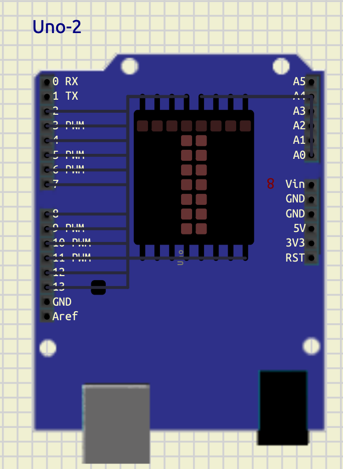
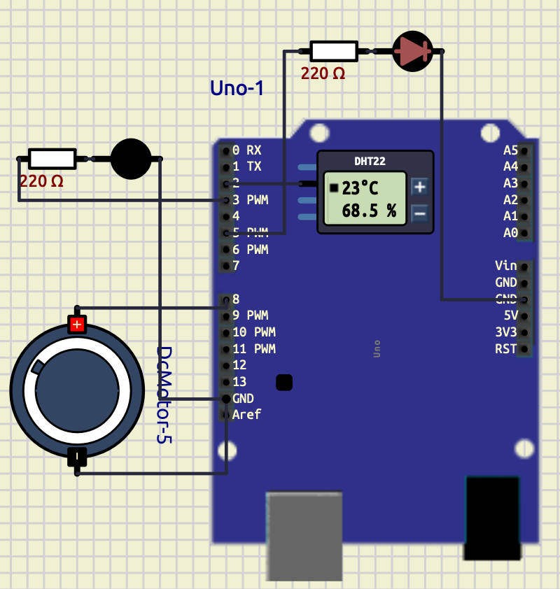
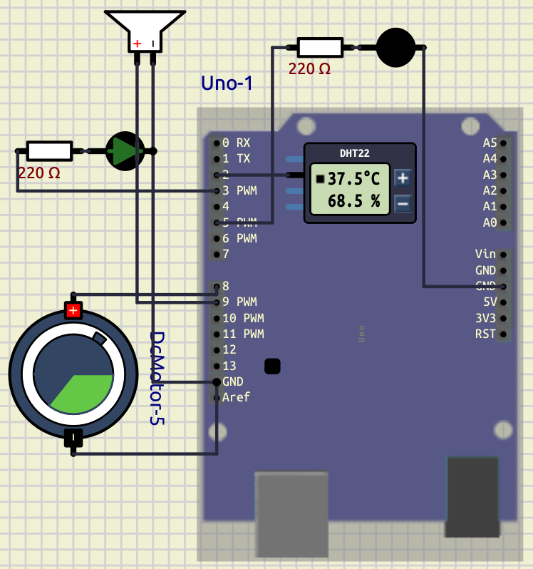

# Digital Electronics Lab Report

---
# Table of Contents

- [[#Exp 0]]
  - [[#1. LED Blink]]
  - [[#2. 7-Segment Display]]
  - [[#3. LED Matrix Display]]

- [[#Exp 1]]
  - [[#1. Temperature Control System]]
  - [[#2. Temperature Control System with Alarm Buzzer]]
  - [[#3. Smart Weather Monitoring and Extreme Temperature Alert System]]
---

# Exp 0

---

## 1. LED Blink

### Objective

To interface an LED with an Arduino board and program it to blink at specific time intervals using digital output pins and delay functions. The experiment demonstrates the basic operation of GPIO (General Purpose Input/Output), use of `pinMode()`, `digitalWrite()`, and timing control using `delay()` in Arduino programming.

---

### Understanding

In this program, the LED connected to digital pin 13 of the Arduino is controlled using software instructions. Inside the `setup()` function, pin 13 is configured as an output pin using `pinMode(13, OUTPUT)`.

The `loop()` function runs continuously. The instruction `digitalWrite(13, HIGH)` turns the LED ON by supplying voltage to the pin, and `delay(1200)` keeps it ON for 1200 milliseconds (1.2 seconds). Then `digitalWrite(13, LOW)` turns the LED OFF, and `delay(1400)` keeps it OFF for 1400 milliseconds (1.4 seconds).

Thus, the LED repeatedly blinks with different ON and OFF durations, demonstrating basic Arduino programming and timing control.

---

### Code

```cpp
void setup() {
  pinMode(13, OUTPUT);
}

void loop() {
  digitalWrite(13, HIGH);
  delay(1200);

  digitalWrite(13, LOW);
  delay(1400);
}
```

---

### Screenshot


---

### Conclusion

The LED blinking program was successfully implemented using the Arduino board. The experiment demonstrated how to configure a digital pin as an output and control the ON/OFF state of an LED using `digitalWrite()` and `delay()` functions.

The LED blinked continuously with specified timing intervals, verifying the correct operation of the program and providing a basic understanding of Arduino GPIO control and embedded programming concepts.

---

## 2. 7-Segment Display

### Objective

To interface a 7-segment display with an Arduino board and display numerical digits from 0 to 9 using digital output pins. The experiment demonstrates the working principle of seven-segment displays, array-based programming, and digital output control in embedded systems.

---

### Understanding

A 7-segment display consists of seven LEDs labeled as `a` to `g`. Different combinations of these segments are turned ON or OFF to display numerical digits.

In this program, the segment pins are stored in the array `segPins[7]`, where each element corresponds to one segment of the display. Another two-dimensional array `digits[10][7]` stores the segment patterns required to display digits from `0` to `9`.

The function `displayDigit(int num)` takes a digit as input and activates the corresponding segments by sending HIGH or LOW signals to the display pins using `digitalWrite()`.

Inside the `loop()` function, a `for` loop continuously counts from `0` to `9`. Each digit is displayed for 1 second using `delay(1000)`.

This experiment demonstrates display interfacing, array handling, function usage, looping structures, and GPIO programming using Arduino.

---

### Code

```cpp
int segPins[7] = {2,3,4,5,6,7,8};

byte digits[10][7] = {
  {1,1,1,1,1,1,0}, //0
  {0,1,1,0,0,0,0}, //1
  {1,1,0,1,1,0,1}, //2
  {1,1,1,1,0,0,1}, //3
  {0,1,1,0,0,1,1}, //4
  {1,0,1,1,0,1,1}, //5
  {1,0,1,1,1,1,1}, //6
  {1,1,1,0,0,0,0}, //7
  {1,1,1,1,1,1,1}, //8
  {1,1,1,1,0,1,1}  //9
};

void displayDigit(int num)
{
  for(int i=0; i<7; i++)
  {
    digitalWrite(segPins[i], digits[num][i]);
  }
}

void setup()
{
  for(int i=0; i<7; i++)
  {
    pinMode(segPins[i], OUTPUT);
  }
}

void loop()
{
  for(int count=0; count<=9; count++)
  {
    displayDigit(count);
    delay(1000);
  }
}
```

---

### Screenshot


---

### Conclusion

The 7-segment display was successfully interfaced with the Arduino board to display digits from 0 to 9 sequentially. The experiment demonstrated how multiple digital output pins can be controlled using arrays and functions to generate different display patterns.

The program verified the proper operation of GPIO control, looping structures, and display interfacing techniques in embedded systems using Arduino programming.

---

## 3. LED Matrix Display

### Objective

To interface an 8×8 LED matrix display with an Arduino board and display the character `T` using row-column scanning techniques. The experiment demonstrates multiplexing, GPIO control, binary pattern representation, and matrix display interfacing in embedded systems.

---

### Understanding

An 8×8 LED matrix consists of 64 LEDs arranged in rows and columns. Each LED is controlled by activating a specific row and column simultaneously.

In this program, the row pins are stored in the array `rowPins[8]` and the column pins are stored in `colPins[8]`. The binary pattern representing the letter `T` is stored in the array `T[8]`.

Each binary value corresponds to one row of the matrix:
- `1` represents an LED that should glow.
- `0` represents an LED that should remain OFF.

Inside the `loop()` function, the program scans each row one at a time. First, all rows are turned OFF. Then the required column pattern is applied using `digitalWrite()` and `bitRead()` functions. Finally, the selected row is activated for a very short duration using `delay(2)`.

This rapid scanning process occurs continuously, creating the illusion of a stable character display due to persistence of vision.

The experiment demonstrates matrix multiplexing, binary data representation, row-column addressing, and display interfacing using Arduino.

---

### Code

```cpp
int rowPins[8] = {2,3,4,5,6,7,8,9};
int colPins[8] = {10,11,12,13,A3,A2,A1,A0};

// Letter T
byte T[8] = {
  B11111111,
  B00011000,
  B00011000,
  B00011000,
  B00011000,
  B00011000,
  B00011000,
  B00011000
};

void setup()
{
  for(int i=0; i<8; i++)
  {
    pinMode(rowPins[i], OUTPUT);
    pinMode(colPins[i], OUTPUT);
  }
}

void loop()
{
  for(int row=0; row<8; row++)
  {
    for(int i=0; i<8; i++)
    {
      digitalWrite(rowPins[i], LOW);
    }

    for(int col=0; col<8; col++)
    {
      if(bitRead(T[row], 7-col))
      {
        digitalWrite(colPins[col], LOW);
      }
      else
      {
        digitalWrite(colPins[col], HIGH);
      }
    }

    digitalWrite(rowPins[row], HIGH);

    delay(2);
  }
}
```

---

### Screenshot



---

### Conclusion

The 8×8 LED matrix display was successfully interfaced with the Arduino board to display the character `T`. The experiment demonstrated how row-column scanning and multiplexing techniques are used to control multiple LEDs efficiently using limited GPIO pins.

The program verified the working of binary pattern mapping, bit manipulation, and dynamic display refreshing in embedded systems using Arduino programming.


# Exp 1

## 1. Temperature Control System

---

### Objective

To interface a temperature sensor with an Arduino board and implement an automatic temperature control system using LEDs and a DC motor. The experiment demonstrates sensor interfacing, conditional control, digital output operation, and automation using Arduino programming.

---
### Components Required

- Arduino Uno
- DHT22 Temperature Sensor
- LEDs
- 220Ω Resistors
- DC Motor
- Connecting Wires
---
### Theory

Temperature monitoring and control systems are widely used in embedded systems and industrial automation. In this experiment, the DHT22 digital temperature sensor is interfaced with the Arduino Uno to continuously monitor environmental temperature.

The Arduino reads temperature data from the sensor and performs different actions depending on the temperature range:

- If temperature exceeds `35°C`:
  - Warning LED turns ON
  - Cooling fan (DC motor) turns ON

- If temperature falls below `25°C`:
  - Heater indicator LED turns ON

- If temperature remains between `25°C` and `35°C`:
  - All outputs remain OFF

The experiment demonstrates:
- Digital sensor interfacing
- GPIO control
- Embedded automation
- Conditional programming using `if-else`
- Temperature-based decision making
---
### Circuit Connections

| Component       | Arduino Pin |
| --------------- | ----------- |
| DHT22 Output    | D2          |
| Warning LED     | D3          |
| Heater LED      | D5          |
| DC Motor/Fan    | D8          |
| GND Connections | GND         |

---
### Arduino Code

```cpp
#include <DHT.h>

#define DHTPIN 2
#define DHTTYPE DHT22

DHT dht(DHTPIN, DHTTYPE);

void setup() {

  Serial.begin(9600);

  dht.begin();

  pinMode(3, OUTPUT);
  pinMode(5, OUTPUT);
  pinMode(8, OUTPUT);
}

void loop() {

  float temp = dht.readTemperature();

  Serial.println(temp);

  if (isnan(temp)) {

    digitalWrite(3, LOW);
    digitalWrite(5, LOW);
    digitalWrite(8, LOW);

    return;
  }

  // HOT CONDITION
  if(temp > 35) {

    digitalWrite(3, HIGH);
    digitalWrite(8, HIGH);
    digitalWrite(5, LOW);
  }

  // COLD CONDITION
  else if(temp < 25) {

    digitalWrite(5, HIGH);
    digitalWrite(3, LOW);
    digitalWrite(8, LOW);
  }

  // NORMAL CONDITION
  else {

    digitalWrite(3, LOW);
    digitalWrite(5, LOW);
    digitalWrite(8, LOW);
  }

  delay(1000);
}
````

---
### **Screenshots**

#### **Heating Condition**

When temperature falls below `25°C`, the heater indicator LED turns ON.


#### **Cooling Condition**

When temperature rises above `35°C`, the warning LED and cooling fan turn ON.


---

### **Observations**

|**Temperature Range**|**Output Condition**|
|---|---|
|Below 25°C|Heater LED ON|
|25°C – 35°C|All Outputs OFF|
|Above 35°C|Warning LED and Fan ON|

---

### **Conclusion**

The experiment successfully demonstrated temperature sensing and automatic control using Arduino. The DHT22 sensor accurately measured temperature, and the Arduino performed appropriate control actions using conditional logic.

The experiment verified practical concepts of:

- Sensor interfacing
- Embedded control systems
- GPIO operation
- Automation techniques
- Real-time monitoring systems

The system can be further expanded for industrial temperature monitoring, smart home automation, and environmental control applications
## 2. Temperature Control System with Alarm Buzzer

---
### Objective

To interface a DHT22 temperature sensor with an Arduino Uno and implement an automatic temperature monitoring and alarm system using LEDs, a DC fan, and an audio buzzer. The experiment demonstrates sensor interfacing, conditional control, embedded automation, and alarm generation based on temperature thresholds.

---
### Components Required

- Arduino Uno
- DHT22 Temperature Sensor
- LEDs
- 220Ω Resistors
- DC Motor / Fan
- Audio Output / Buzzer
- Connecting Wires
---

### Theory

Temperature monitoring and alarm systems are important in industrial automation, environmental monitoring, and safety applications. In this experiment, the DHT22 sensor continuously measures ambient temperature and sends the data digitally to the Arduino.

The Arduino compares the measured temperature with predefined threshold values and performs different actions accordingly.

- If temperature exceeds `35°C`:
  - Warning LED turns ON
  - Cooling fan turns ON

- If temperature exceeds `45°C`:
  - Audio alarm activates
  - Warning LED and cooling fan remain ON

- If temperature falls below `25°C`:
  - Heater indicator LED turns ON

- If temperature remains between `25°C` and `35°C`:
  - All outputs remain OFF
---

### Circuit Connections

| Component | Arduino Pin |
|---|---|
| DHT22 Output | D2 |
| Warning LED | D3 |
| Heater LED | D5 |
| Cooling Fan / Motor | D8 |
| Audio Alarm / Buzzer | D9 |
| GND Connections | GND |

---

### Arduino Code

```cpp
#include <DHT.h>
#define DHTPIN 2
#define DHTTYPE DHT22

DHT t(DHTPIN,DHTTYPE);

void setup() {

  Serial.begin(9600);

  t.begin();

  pinMode(3, OUTPUT);
  pinMode(5, OUTPUT);
  pinMode(8, OUTPUT);
  pinMode(9, OUTPUT);
}

void loop() {

  float temp = t.readTemperature();

  Serial.println(temp);

  if(isnan(temp)) {

    digitalWrite(3, LOW);
    digitalWrite(5, LOW);
    digitalWrite(8, LOW);
    digitalWrite(9, LOW);

    return;
  }

  // CRITICAL HIGH TEMPERATURE
  if (temp > 45) {

    tone(9, 1000);

    digitalWrite(3, HIGH);
    digitalWrite(8, HIGH);
    digitalWrite(5, LOW);
  }

  else {

    noTone(9);
  }

  // HIGH TEMPERATURE
  if (temp > 35) {

    digitalWrite(3, HIGH);
    digitalWrite(8, HIGH);
    digitalWrite(5, LOW);
  }

  // LOW TEMPERATURE
  else if(temp < 25) {

    digitalWrite(3, LOW);
    digitalWrite(8, LOW);
    digitalWrite(5, HIGH);
  }

  // NORMAL TEMPERATURE
  else {

    digitalWrite(3, LOW);
    digitalWrite(8, LOW);
    digitalWrite(5, LOW);
  }

  delay(500);
}
````

---

### **Screenshots**

#### **Heating Condition**

When temperature falls below `25°C`, the heater indicator LED turns ON.

---

#### **Cooling Condition**

When temperature rises above `35°C`, the warning LED and cooling fan turn ON.

---
### Critical Temperature Alarm Condition

.png)

When temperature rises above `45°C`, the warning LED, cooling fan, and audio alarm system turn ON simultaneously to indicate a critical high-temperature condition.

---

### **Observations**

|**Temperature Range**|**Output Condition**|
|---|---|
|Below 25°C|Heater LED ON|
|25°C – 35°C|All Outputs OFF|
|Above 35°C|Warning LED + Fan ON|
|Above 45°C|Warning LED + Fan + Audio Alarm ON|

---

### **Conclusion**

The experiment successfully demonstrated an automatic temperature monitoring and alarm system using Arduino. The DHT22 sensor continuously measured environmental temperature, and the Arduino performed appropriate control actions based on predefined thresholds.

The experiment verified:

- Sensor interfacing
- Real-time monitoring
- Embedded automation
- Alarm generation
- GPIO control
- Conditional programming

The system can be further extended for industrial safety systems, smart home automation, fire warning systems, and environmental monitoring applications.
## 3. Smart Weather Monitoring and Extreme Temperature Alert System

---
### Objective

To design and implement a smart weather monitoring system using Arduino Uno, DHT22 sensor, LCD display, LEDs, DC motor, and buzzer. The system continuously monitors temperature and humidity conditions and displays different weather states such as normal weather, hot weather, cold weather, heat wave, and extreme temperature alerts.

---
### Components Required

- Arduino Uno
- DHT22 Temperature and Humidity Sensor
- 16×2 LCD Display (HD44780)
- LEDs
- 220Ω Resistors
- DC Motor / Fan
- Audio Output / Buzzer
- Connecting Wires
---
### Theory

Smart weather monitoring systems are widely used in embedded systems, environmental monitoring, industrial automation, and safety systems. In this experiment, the DHT22 sensor continuously measures environmental temperature and humidity and sends the data digitally to the Arduino Uno.

The Arduino processes the sensor values and displays different weather conditions on a 16×2 LCD display. Depending on temperature and humidity conditions, LEDs, cooling fan, and alarm systems are activated automatically.

The system works according to the following conditions:

- `Temperature > 45°C`
  - Extreme Temperature Alert
  - Buzzer ON
  - Cooling Fan ON
  - Warning LED ON

- `Temperature > 40°C and Humidity < 30%`
  - Heat Wave Detection

- `Temperature > 35°C`
  - Hot Weather Condition

- `Temperature < 15°C`
  - Cold Weather Condition

- `Humidity > 80%`
  - Rain Possibility Detection

- Otherwise:
  - Normal Weather Condition

---
### Circuit Connections

| Component             | Arduino Pin |
| --------------------- | ----------- |
| DHT22 Output          | D2          |
| Warning LED           | D3          |
| Heater LED            | D5          |
| Cooling Fan / Motor   | D8          |
| Buzzer / Audio Output | D9          |
| LCD RS                | A0          |
| LCD EN                | A1          |
| LCD D4                | A2          |
| LCD D5                | A3          |
| LCD D6                | A4          |
| LCD D7                | A5          |

---
### Arduino Code

```cpp
#include <DHT.h>
#include <LiquidCrystal.h>

LiquidCrystal lcd(A0, A1, A2, A3, A4, A5);

#define DHTPIN 2
#define DHTTYPE DHT22

DHT t(DHTPIN, DHTTYPE);

void setup() {

  Serial.begin(9600);

  t.begin();

  lcd.begin(16,2);

  pinMode(3, OUTPUT);
  pinMode(5, OUTPUT);
  pinMode(8, OUTPUT);
  pinMode(9, OUTPUT);
}

void loop() {

  float temp = t.readTemperature();
  float humid = t.readHumidity();

  Serial.print("Temperature: ");
  Serial.println(temp);

  Serial.print("Humidity: ");
  Serial.println(humid);

  if(isnan(temp) || isnan(humid)) {

    digitalWrite(3, LOW);
    digitalWrite(5, LOW);
    digitalWrite(8, LOW);

    noTone(9);

    lcd.clear();

    lcd.setCursor(0,0);
    lcd.print("SENSOR ERROR");

    delay(1000);

    return;
  }

  if(temp > 45) {

    tone(9,1000);

    digitalWrite(3, HIGH);
    digitalWrite(8, HIGH);
    digitalWrite(5, LOW);

    lcd.clear();

    lcd.setCursor(0,0);
    lcd.print("EXTREME TEMP");

    lcd.setCursor(0,1);
    lcd.print("ALERT");
  }

  else if(temp > 40 && humid < 30) {

    noTone(9);

    digitalWrite(3, HIGH);
    digitalWrite(8, HIGH);
    digitalWrite(5, LOW);

    lcd.clear();

    lcd.setCursor(0,0);
    lcd.print("HEAT WAVE");

    lcd.setCursor(0,1);
    lcd.print("DRY WEATHER");
  }

  else if(temp > 35) {

    noTone(9);

    digitalWrite(3, HIGH);
    digitalWrite(8, HIGH);
    digitalWrite(5, LOW);

    lcd.clear();

    lcd.setCursor(0,0);
    lcd.print("HOT WEATHER");

    lcd.setCursor(0,1);
    lcd.print("TEMP HIGH");
  }

  else if(temp < 15) {

    noTone(9);

    digitalWrite(3, LOW);
    digitalWrite(8, LOW);
    digitalWrite(5, HIGH);

    lcd.clear();

    lcd.setCursor(0,0);
    lcd.print("COLD WEATHER");

    lcd.setCursor(0,1);
    lcd.print("TEMP LOW");
  }

  else if(humid > 80) {

    noTone(9);

    digitalWrite(3, LOW);
    digitalWrite(5, LOW);
    digitalWrite(8, LOW);

    lcd.clear();

    lcd.setCursor(0,0);
    lcd.print("RAIN");

    lcd.setCursor(0,1);
    lcd.print("POSSIBILITY");
  }

  else {

    noTone(9);

    digitalWrite(3, LOW);
    digitalWrite(5, LOW);
    digitalWrite(8, LOW);

    lcd.clear();

    lcd.setCursor(0,0);
    lcd.print("NORMAL");

    lcd.setCursor(0,1);
    lcd.print("WEATHER");
  }

  delay(1000);
}
````
---
### **Screenshots**

#### **Hot Weather Condition**

![[Experiments/exp1/weather_forecast/hot.png]]

When the temperature exceeds `35°C`, the warning LED and cooling fan turn ON, and the LCD displays **“HOT WEATHER”**.

---

#### **Cold Weather Condition**

![[Experiments/exp1/weather_forecast/cold.png]]

When the temperature falls below `15°C`, the heater indicator LED turns ON and the LCD displays **“COLD WEATHER”**.

---

#### **Extreme Temperature Alert**

![[Experiments/exp1/weather_forecast/extreme.png]]

When the temperature exceeds `45°C`, the buzzer activates along with the warning LED and cooling fan, and the LCD displays **“EXTREME TEMP ALERT”**.

---

#### **Normal Weather Condition**

![[Experiments/exp1/weather_forecast/normal.png]]

When the temperature and humidity remain within the normal range, all indicators remain OFF and the LCD displays **“NORMAL WEATHER”**.

*Extreme temperatures and rain possibility is not shown.*

---
### **Observations**

| **Weather Condition**                 | **Output Response**                   |
| ------------------------------------- | ------------------------------------- |
| Temperature < 15°C                    | Heater LED ON                         |
| 15°C – 35°C                           | Normal Weather                        |
| Temperature > 35°C                    | Warning LED + Cooling Fan ON          |
| Temperature > 45°C                    | Warning LED + Cooling Fan + Buzzer ON |
| Humidity > 80%                        | Rain Possibility Detection            |
| Temperature > 40°C and Humidity < 30% | Heat Wave Detection                   |

---
### **Conclusion**

The experiment successfully demonstrated a smart weather monitoring and alert system using Arduino and DHT22 sensor interfacing. The system continuously monitored temperature and humidity and automatically generated warnings and alerts based on environmental conditions.

The experiment verified:

- Sensor interfacing
- LCD interfacing
- Real-time environmental monitoring
- Alarm systems
- Embedded automation
- Weather condition detection
- Conditional control systems

The project can be further extended into smart weather stations, industrial environmental monitoring systems, smart home automation, and disaster warning systems.